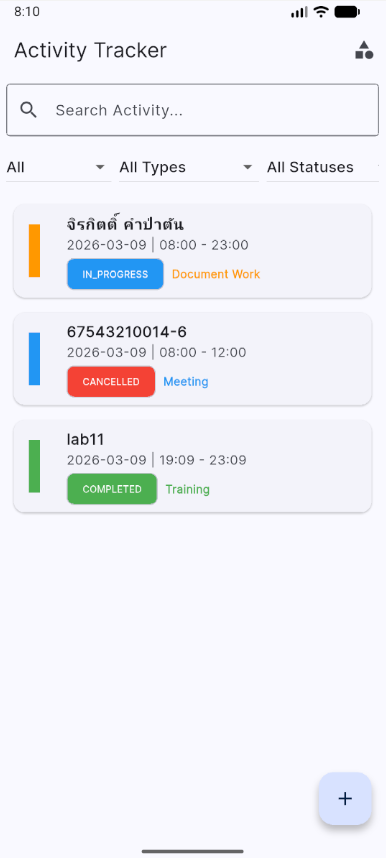
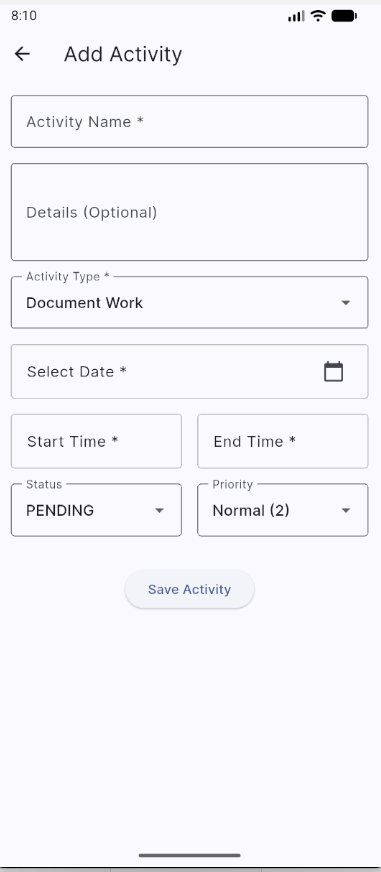
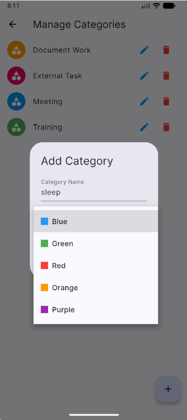
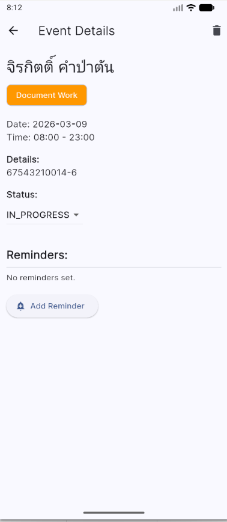

## จิรกิตติ์ คำป่าตัน 67543210014-6 
## Lab11
------------------------------------------------------------------------------------

1. ฐานข้อมูล (app_database.dart)
ใช้ SQLite ผ่าน sqflite สร้าง 3 ตาราง ได้แก่ categories, events, reminders โดยมี Foreign Key ควบคุมความสัมพันธ์ และใส่ข้อมูล Category เริ่มต้น 4 ประเภท (Meeting, Training, External Task, Document Work) ตอนสร้าง DB ครั้งแรก
2. Models & Repositories
แต่ละ model มี toMap() / fromMap() สำหรับแปลงข้อมูลไป-กลับ SQLite และมี copyWith() สำหรับอัปเดตบางฟิลด์ โดย Repository แต่ละตัวรับผิดชอบ CRUD ของตารางตัวเอง ทั้งนี้ CategoryRepository จะป้องกันการลบ Category ที่มี Event ใช้งานอยู่
3. Providers (State Management)

CategoryProvider โหลด Category จาก DB ตอนเริ่มต้น และ refresh หลังทุก CRUD
EventProvider จัดการ Event ทั้งหมด พร้อม filter (ค้นหา, วันที่, ประเภท, สถานะ) และ sort (ตามเวลาเริ่ม หรือล่าสุดอัปเดต) เมื่อเปลี่ยน status เป็น completed/cancelled จะปิด Reminder อัตโนมัติ

4. หน้าจอหลัก
หน้าจอหน้าที่ActivityListScreenแสดงรายการ Event พร้อม Filter Bar และสี 
CategoryAddEditEventScreenForm เพิ่ม/แก้ไข Event พร้อม validate เวลา
EventDetailsScreenดูรายละเอียด, เปลี่ยน Status, จัดการ 
ReminderManageCategoriesScreenCRUD Category พร้อมเลือกสี

------------------------------------------------------------------------------------

